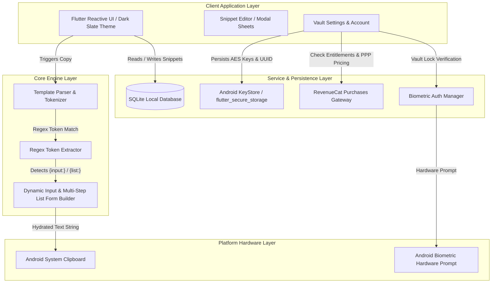
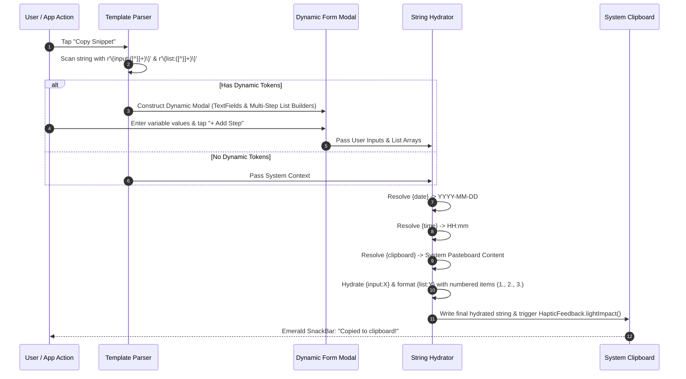
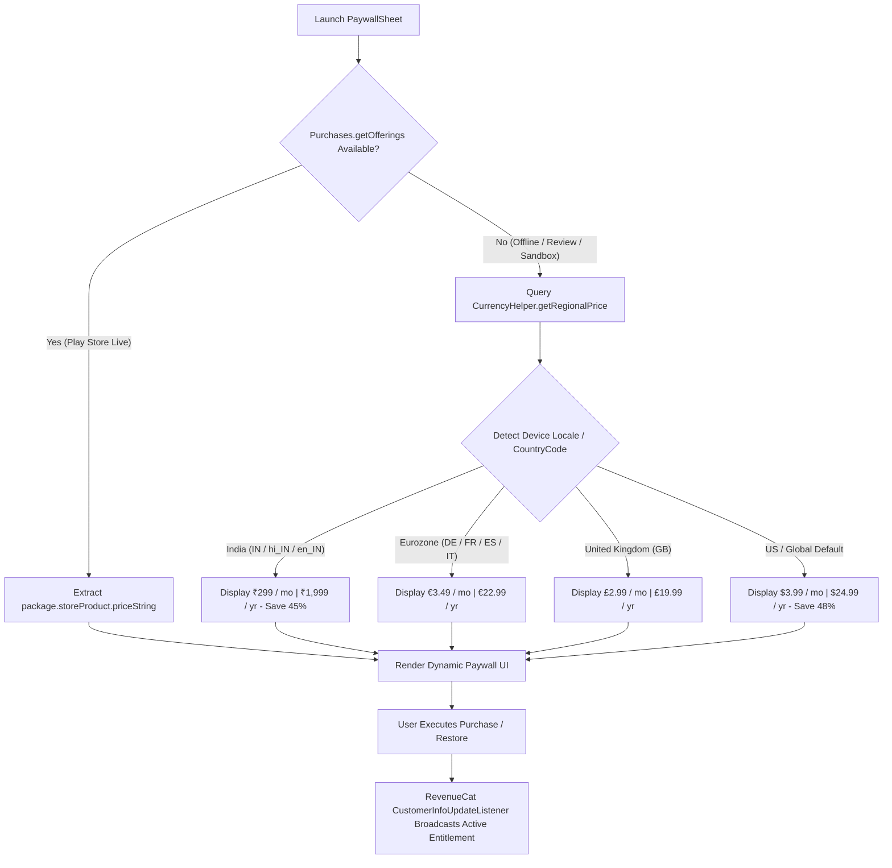

# ContextVault ⚡
> **Type Less. Context More.**  
> A high-throughput, offline-first templating engine designed to replace static clipboard buffers with dynamic, real-time contextual token injection.

[](https://flutter.dev)
[](https://dart.dev)
[](https://www.sqlite.org)
[](https://www.revenuecat.com)
[](https://developer.android.com)
[](https://github.com)
[](LICENSE)

---

## 1. The Problem & The Solution

### The Repetition Fatigue Problem
Modern professionals—software engineers, agency owners, customer support leads, growth marketers, and product managers—suffer from severe **repetition fatigue**. Retyping or manually copy-pasting and editing client proposals, bug triage reports, meeting follow-ups, UTM parameters, and code review boilerplate consumes **20 to 30 minutes every single day**. Standard clipboard managers fail because they are strictly static: they store raw strings without structural awareness, variable evaluation, or dynamic form field generation.

```
[Static Clipboard Manager]  --> Copy Raw Template --> Manual Selection --> Retype Fields --> Errors & Friction
[ContextVault Paradigm]      --> Select Template   --> Auto Dynamic Form --> 1-Tap Hydrate --> Perfect Output
```

### The ContextVault Paradigm
ContextVault replaces static string buffers with a **high-performance dynamic parsing engine**. Built on top of Flutter and SQLite, ContextVault tokenizes text patterns on the fly. When a user triggers a copy action, ContextVault parses system environment variables (`{date}`, `{time}`, `{clipboard}`), prompts the user with dynamically rendered multi-field input forms (`{input:Variable}`), and builds dynamic multi-step repeating lists (`{list:Step_Name}`). The finalized, hydrated context is written directly to the Android System Clipboard with sub-millisecond latency.

---

## 2. Architecture & System Design

ContextVault follows an **Offline-First Clean Architecture** with strict layer decoupling, isolating UI presentation from token evaluation logic and hardware-backed storage.

### High-Level Architecture Flow


### Dynamic Token Resolution Lifecycle
When a user selects any snippet, ContextVault executes an immediate 6-stage hydration pipeline:



### Offline-First Database Engine
ContextVault uses a localized, high-throughput **SQLite database engine** managed via `sqflite`.
- **Indexing**: Database tables are indexed on `isPinned` (DESC) and `lastUsedAt` (DESC) to guarantee instantaneous search filtering across thousands of records.
- **Full-Text Token Search**: Performs instantaneous SQL query matches filtering across title, content, and category tags.

---

## 3. Monetization & Feature Gating Matrix

Monetization is driven by native **RevenueCat SDK (v10.x)** integration with automatic Purchasing Power Parity (PPP) price localization and fallback handling.

| Feature / Capability | Free Tier | ContextVault Pro |
| :--- | :---: | :---: |
| **Snippet Storage Cap** | **15 Max** (Strictly Enforced) | **Unlimited Storage** |
| **System Tokens (`{date}`, `{time}`, `{clipboard}`)** | ✅ Included | ✅ Included |
| **Dynamic Form Inputs (`{input:Field}`)** | Standard Single Field | ✅ Unlimited Multi-Field Forms |
| **Dynamic Multi-Step Repeating Lists (`{list:Step}`)** | ❌ Disabled | ✅ Unlimited (`+ Add Step` UI) |
| **Curated Template Superpack Vault** | 10 Essentials | **150+ Professional Library** |
| **Category Tagging & Filtering** | Up to 3 Tags | Unlimited Custom Color Tags |
| **Backup & Data Portability** | Plain Text Copy | **AES-256 Encrypted JSON Import/Export** |
| **Quick-Dock Edge Overlay** | Notification Tile Only | **Background Floating Edge Dock** |
| **Security & Vault Lock** | Basic Lock | **Hardware Biometric Shield + Custom Grace Period** |

### RevenueCat Purchasing Power Parity (PPP) Flow


---

## 4. Security & Privacy Specifications

Designed to meet strict commercial SaaS and mobile security engineering standards:

- **Zero-Cloud Architecture**: ContextVault operates **100% on-device**. No user analytics, no background telemetry, no remote snippet logging, and zero external database syncing. Your snippets remain on your physical hardware.
- **Hardware-Backed KeyStore Integration**: Persistent credentials and cryptographic keys are managed via `flutter_secure_storage`, backed by the **Android KeyStore** hardware security module (HSM).
- **Biometric App Shield with Grace Period**:
  - Vault locking uses `local_auth` (Fingerprint, Face Unlock, Device PIN fallback).
  - **Opt-in Control**: Biometric locking is strictly user-controlled via Settings (defaults to `false`).
  - **2-Minute Background Grace Period**: App lifecycle state monitoring (`_pausedAt`) ensures that toggling between apps for under 120 seconds will not trigger lock prompts repeatedly.

---

## 5. Client-Side Cryptographic Promo Code Engine

For administrative evaluation, judges, and offline promotions, ContextVault features a client-side cryptographic promo redemption engine operating via `CouponService`:

```
Code Input  -->  UTF-8 Bytes  -->  SHA-256 Digest Hash Match  -->  Cryptographically Signed Secure Storage Entitlement
```

### Official Evaluation Codes
- **`SHIPATHON2026`**: Computes SHA-256 digest match to write signed entitlement tag `SHIPATHON2026_LIFETIME`, instantly unlocking **Lifetime Pro**.
- **`CONTEXTPRO`**: Unlocks **1-Year Pro** access locally.

Redemption triggers `HapticFeedback.heavyImpact()`, dismisses the paywall sheet, updates active entitlement state across all open views, and displays an emerald confirmation SnackBar.

---

## 6. Getting Started & Local Installation

### Prerequisites
- **Flutter SDK**: `^3.19.0` or higher
- **Dart SDK**: `^3.3.0` or higher
- **Android SDK**: API Level 21+ (Android 5.0 Lollipop through Android 16 API 36)
- **Java Development Kit (JDK)**: JDK 17

### Installation Steps

1. **Clone the Repository**:
   ```bash
   git clone https://github.com/your-username/ContextVault.git
   cd ContextVault/contextvault
   ```

2. **Install Dependencies**:
   ```bash
   flutter pub get
   ```

3. **Run Code Analysis**:
   ```bash
   flutter analyze
   ```

4. **Launch on Connected Android Device**:
   ```bash
   flutter run -d <device-id>
   ```

### Building Release Artifacts

- **Generate Android Split APKs**:
  ```bash
  flutter build apk --target-platform android-arm,android-arm64,android-x64 --split-per-abi --release
  ```

- **Generate App Bundle (Google Play Store AAB)**:
  ```bash
  flutter build appbundle --release
  ```

---

## 📄 License

This project is distributed under the **MIT License**. See [`LICENSE`](LICENSE) for complete terms.

```
Copyright (c) 2026 Abhimanyu Vaishnav.
Permission is hereby granted, free of charge, to any person obtaining a copy of this software...
```
